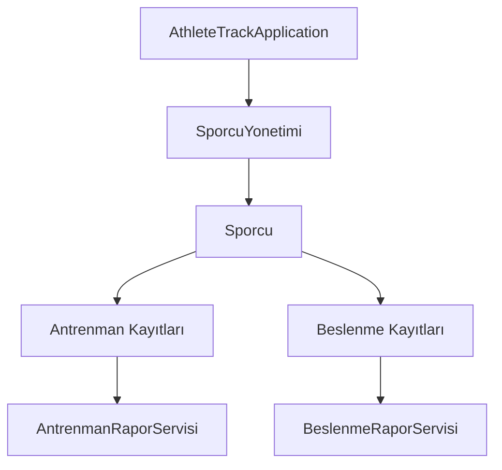

# AthleteTrack

AthleteTrack, sporcuların antrenman ve günlük beslenme kayıtlarını takip etmek amacıyla geliştirilmiş, konsol tabanlı bir Java OOP projesidir.

Proje; nesne yönelimli programlama, sınıflar arası ilişkiler, koleksiyonlar, enum kullanımı ve servis katmanı mantığını uygulamalı olarak öğrenmek amacıyla geliştirilmiştir.

## Özellikler

- Sporcu oluşturma ve kayıtlı sporcuları listeleme
- Tarihe göre antrenman kaydı ekleme
- Hareketlere birden fazla set ekleme
- Ağırlık ve tekrar sayısından set, hareket ve antrenman hacmi hesaplama
- İki farklı antrenmanın toplam hacmini karşılaştırma
- Belirli bir hareketin iki tarih arasındaki hacim değişimini karşılaştırma
- Günlük öğün ve besin porsiyonu kaydı oluşturma
- Kalori, protein, karbonhidrat ve yağ miktarlarını hesaplama
- Aktivite seviyesi ve beslenme hedefine göre günlük kalori ihtiyacı hesaplama
- Beslenme hedefine göre günlük protein ihtiyacı hesaplama
- Alınan kalori ve proteini hedef değerlerle karşılaştırma
- Aynı sporcu için tarih bazlı antrenman ve beslenme kaydı yönetimi
- Scanner ile çalışan etkileşimli konsol menüsü

## Kullanılan Teknolojiler ve Kavramlar

- Java
- Nesne yönelimli programlama (OOP)
- Encapsulation ve composition
- Enum
- List, ArrayList, Map ve HashMap
- LocalDate
- Scanner
- Servis ve rapor sınıfları
- Temel giriş doğrulama işlemleri

## Uygulama Menüsü

```text
========== ATHLETE TRACK ==========
1- Sporcu ekle
2- Sporcuları listele
3- Antrenman ekle
4- Günlük beslenme kaydı ekle
5- Beslenme raporu görüntüle
6- Toplam antrenman hacmini karşılaştır
7- Hareket hacmini karşılaştır
0- Çıkış
===================================
```

## Proje Yapısı

```text
src/
├── AthleteTrackApplication.java
├── Sporcu.java
├── SporcuYonetimi.java
├── Antrenman.java
├── Hareket.java
├── HareketSeti.java
├── AntrenmanRaporServisi.java
├── Besin.java
├── BesinPorsiyonu.java
├── Ogun.java
├── GunlukBeslenme.java
├── BeslenmeHesaplayici.java
├── BeslenmeRaporu.java
├── BeslenmeRaporServisi.java
└── Enum sınıfları
```

## Temel Sınıfların Sorumlulukları

| Sınıf | Sorumluluk |
|---|---|
| `Sporcu` | Kişisel bilgileri, antrenman kayıtlarını ve beslenme kayıtlarını tutar. |
| `SporcuYonetimi` | Sporcuları ID üzerinden ekler, getirir, günceller, siler ve listeler. |
| `Antrenman` | Belirli bir tarihteki hareketleri ve toplam antrenman hacmini yönetir. |
| `Hareket` | Hareket adını ve harekete ait setleri tutar. |
| `HareketSeti` | Ağırlık ve tekrar sayısından set hacmini hesaplar. |
| `AntrenmanRaporServisi` | Tarihler arasındaki toplam antrenman ve hareket hacmi farklarını hesaplar. |
| `Besin` | Bir besinin 100 gramlık kalori ve makro değerlerini tutar. |
| `BesinPorsiyonu` | Tüketilen gram miktarına göre kalori ve makroları hesaplar. |
| `Ogun` | Birden fazla besin porsiyonunu bir öğün altında toplar. |
| `GunlukBeslenme` | Bir tarihteki öğünleri ve günlük toplam besin değerlerini tutar. |
| `BeslenmeHesaplayici` | Temel, aktivite sonrası ve hedef kaloriyi; ayrıca protein hedefini hesaplar. |
| `BeslenmeRaporServisi` | Sporcu ID'si ve tarihe göre beslenme raporunu oluşturur. |

## Mimari Akış



## Çalıştırma

### Gereksinimler

- JDK 17 veya üzeri
- IntelliJ IDEA veya başka bir Java IDE'si

### Adımlar

1. Repositoryyi bilgisayarınıza klonlayın:

```bash
git clone https://github.com/mehmetyilmazalan/AthleteTrack.git
```

2. Projeyi IntelliJ IDEA ile açın.
3. Project SDK olarak uygun bir JDK seçin.
4. `src/AthleteTrackApplication.java` dosyasını açın.
5. `main` metodunu çalıştırın.
6. Konsol menüsündeki numaraları kullanarak kayıt oluşturun ve raporları görüntüleyin.

Tarih girişleri `yyyy-MM-dd` biçiminde yapılmalıdır. Örnek:

```text
2026-08-17
```

Ondalıklı sayılarda nokta kullanılmalıdır. Örnek:

```text
75.5
```

## Hesaplama Mantığı

- Set hacmi: `ağırlık × tekrar sayısı`
- Hareket hacmi: harekete ait set hacimlerinin toplamı
- Antrenman hacmi: antrenmandaki hareket hacimlerinin toplamı
- Temel kalori: Mifflin-St Jeor formülü
- Aktivite kalorisi: temel kalori × aktivite katsayısı
- Hedef kalori: aktivite kalorisi × beslenme hedefi katsayısı
- Protein hedefi: vücut ağırlığı × beslenme hedefi protein katsayısı

## Mevcut Sınırlar

- Veriler uygulama belleğinde tutulur ve program kapatıldığında silinir.
- Veritabanı veya dosya kalıcılığı bulunmaz.
- Bazı negatif değer ve menü sınırı kontrolleri sonraki geliştirmelere bırakılmıştır.
- Proje bir öğrenme çalışması olduğu için herhangi bir tıbbi veya profesyonel beslenme önerisi sunmaz.

## Planlanan Geliştirmeler

- Girdi doğrulamalarını genişletme
- JUnit ile otomatik testler
- Veritabanı desteği
- Katmanlı mimariyi geliştirme
- Spring Boot ve REST API sürümü

## Geliştirici

[Mehmet Yılmaz Alan](https://github.com/mehmetyilmazalan)
